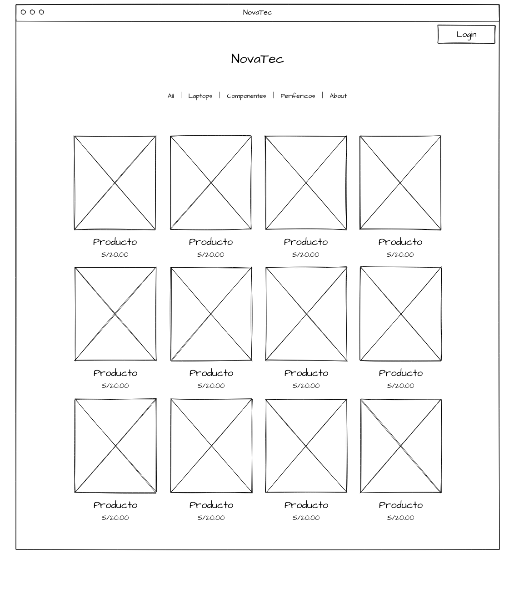
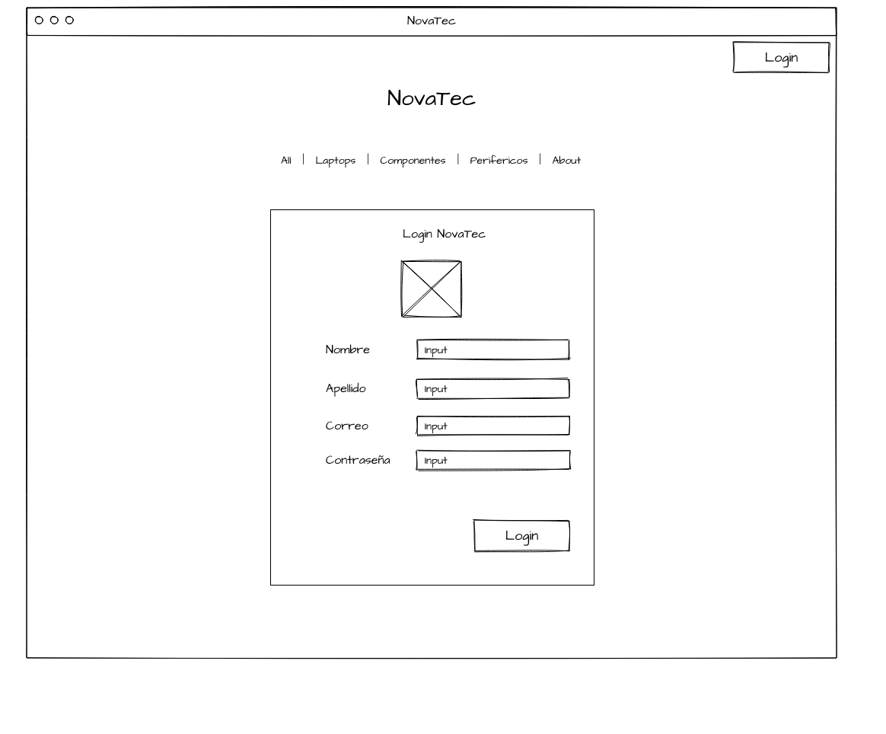
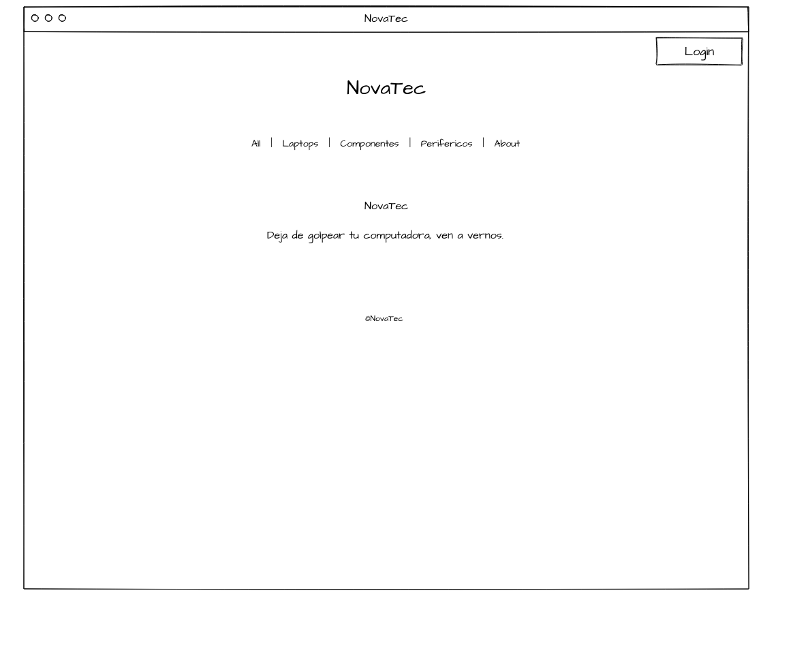

hola, ahora estoy sentado aburrido escribiendo esto...()

# NovaTec

#### Actualización:

Cambiare varios diseño, en realidad me da flojera hacer cada caja donde iran las imagenes, también cambiare el nav. Solo haré una sección donde irá todos los productos.

En realidad no se que nombre ponerle. Pienso que este proyecto sera mejor que los otros que eh hecho. <i>(Actualización ya esta el nombre)</i>

Proyecto web que tendre que realizar yo solo, tengo 2 proyectos más pendiente y quiero terminar un avanze de esto.

## Resumen

Realizar una tienda online, donde los clientes podran comprar y realizar sus pagos de forma segura y asi mismo se podra ver como los administradores de la tienda podran agregar productos a la web. Solo los que son administradores podran ver su apartado.

## Introducción

<b>NovaTec</b> tiene una tienda fisica y esto limita el alcance del mercado y la capacidad de poder generar ventas, implemantamos un sitio web para que los clientes de una manera más comoda puedan visitar nuestra tienda, incluso implementamos un sistema de inventario de ventas y atención al cliente, lo que puede generar un mayor agrado al cliente.

(objetivos)

  1. Una buena experiencia
  2. Automatizar procesos de las ventas.
  3. Optimizar el atención al cliente.

(Impacto)

  1. Aumento de ventas.
  2. Mejorar la experiencia al cliente.
  3. Tener buena eficiencia.

## Diagnóstico

<i>Oportunidades:</i>
  * Aumento de ventas
  * Mejora en al experiencia del Cliente
  * Expansión del Mercado

## Objetivos

OBJ 1.- AUMENTAR LAS VENTAS

  * Específico: Incrementar las ventas mediante la implementación de una tienda en linea.
  * Mediable  : Monitorear el aumento de las ventas utilizando herramientas de análisis.
  * Alcanzable: Hacer una estrategia de marketing.
  * Relevantes: Aumentar las ventas.
  * Tiempo    : El objetivo es alcanzar una gran venta dentro de los primeros 6 meses. 

OBJ 2.- MEJORAR LA SATISFACCIÓN AL CLIENTE

  * Específico: Elevar la satisfacción del cliente proporcionando una experiencia de compra en línea optimizada
  * Mediable  : Utilizar encuestas de satisfacción del cliente.
  * Alcanzable: Implementar mejoras continuas en el servicio del cliente.
  * Relevantes: Satisfacción del cliente para fomentar lealtad.
  * Tiempo    : Debe alcanzarse dentro el primer año.

## Justificación del Proyecto

El desarrollo de una tienda online para NovaTec es una necesidad de crecimiento tecnológicamente. Este proyecto tiene un potencial de poder transformar no solo las ventas online sino la experiencia de compras de los clientes y tener un buen servicio.

## Definición y alcance

<i>Definición del proyecto:</i>

Una tienda virtual que ofrece una amplia variedad de productos tecnológicos. El sitio web permite a los clientes navegar por distintas secciones y realizar compras seguras, recibiendo el pedido en su casa.

<i>Alcance del proyecto:</i>

Integración de Sistemas:

-> Gestión de inventario: Implementar un sistema de inventario en los productos.
-> Marketing y promociones: Gestionar promociones, descuentos y programas de fidelización.

Atención al cliente:

-> Soporte al cliente: Integración de un formulario para el soporte.

Desarrollo de la Plataforma:

-> Diseño de interfaz: Crear un diseño amigable que facilite la navegación y que tenga una buena experiencia de compra.

## Productos y entregables

